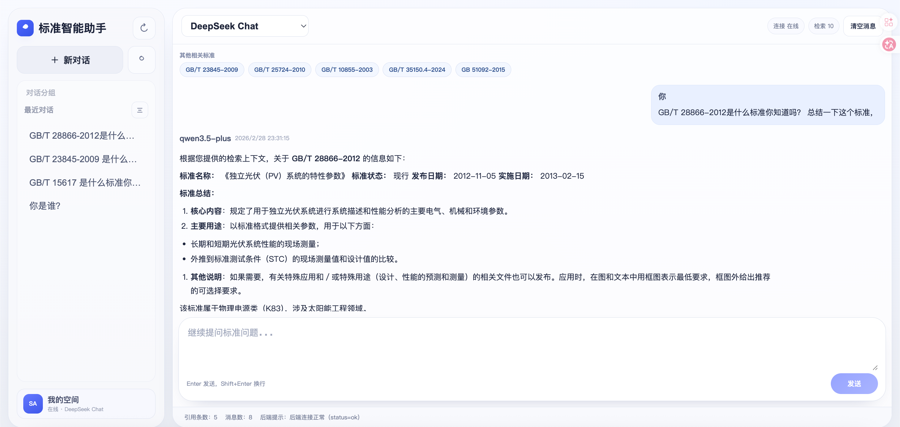

# 标准智能助手 (Standard Assistant)

一个面向“标准信息问答”场景的 Web 智能助手项目。  
核心目标是通过 RAG（检索增强生成）减少问答幻觉，让回答基于真实标准数据并附带可追溯引用。

## 项目演示

### Web 前端（桌面端）



## 主要能力

- 标准问答：支持标准号、标准名称、状态、适用范围等问题
- RAG 检索增强：先向量检索，再结合检索结果生成回答
- 引用展示：回答中展示“其他相关标准”（标准号）
- 流式输出：SSE 实时返回回答内容
- 对话记忆：基于 Redis 的多轮会话记忆
- 多模型切换：支持 DeepSeek / Qwen 模型切换
- 前后端分离：`frontend/` 与 `backend/` 独立开发运行

## 技术栈

- 前端：React 18 + TypeScript + Vite
- 后端：FastAPI + LangChain
- 大模型：DeepSeek、Qwen（OpenAI 兼容调用）
- Embedding：`text-embedding-v4`
- 结构化数据：PostgreSQL
- 向量数据库：Chroma（本地持久化）
- 记忆存储：Redis

## 项目结构

```text
.
├── frontend/                          # Web 前端
├── backend/                           # FastAPI + LangChain 后端
│   ├── app/
│   │   ├── api/                       # 路由层
│   │   ├── services/                  # 问答/RAG/记忆服务
│   │   └── core/                      # 配置
│   └── scripts/
│       ├── ingest_standards_meta_to_chroma.py  # 元信息向量化入库
│       ├── test_chroma_vectors.py              # 向量检索验证
│       └── evaluate_rag.py                     # RAG 评测
├── docs/
│   ├── images/                        # README 演示截图
│   └── *.md                           # 需求、方案、开发计划文档
├── docker-compose.yml
└── README.md
```

## 快速开始

### 1) 启动后端

```bash
cd "/Users/lfc/Documents/New project/backend"
python -m venv .venv
source .venv/bin/activate
pip install -r requirements.txt
cp .env.example .env
# 按 .env.example 填写 API Key 等配置
uvicorn app.main:app --reload --host 0.0.0.0 --port 8000
```

### 2) 启动前端

```bash
cd "/Users/lfc/Documents/New project/frontend"
npm install
npm run dev
```

默认访问地址：

- 前端：[http://127.0.0.1:5173](http://127.0.0.1:5173)
- 后端：[http://127.0.0.1:8000](http://127.0.0.1:8000)
- 健康检查：[http://127.0.0.1:8000/api/v1/health](http://127.0.0.1:8000/api/v1/health)

## RAG 数据准备

执行元信息向量化入库（首次建议先导入 10000 条验证）：

```bash
cd "/Users/lfc/Documents/New project/backend"
python scripts/ingest_standards_meta_to_chroma.py --truncate --count 10000
```

当前用于向量文本构建的核心字段：

- `a100` 标准号
- `a298` 标准名称
- `a101` 发布日期
- `a205` 实施日期
- `a206` 作废日期
- `a000` / `a200` 标准状态
- `a825cn` 中国标准分类（中文）
- `a826cn` 国际标准分类（中文）
- `a330` 适用范围

## 常用接口

- `GET /api/v1/health`：服务健康检查
- `GET /api/v1/models`：获取可用模型列表
- `POST /api/v1/chat`：非流式问答
- `POST /api/v1/chat/stream`：SSE 流式问答

## 相关文档

- [标准智能助手当前执行开发计划（逐步明细）](docs/标准智能助手当前执行开发计划（逐步明细）.md)
- [标准智能助手前后端详细开发计划](docs/标准智能助手前后端详细开发计划.md)
- [标准知识检索RAG接入方案与资料清单](docs/标准知识检索RAG接入方案与资料清单.md)
- [标准智能助手需求与技术方案](docs/标准智能助手需求与技术方案.md)
- [GitHub提交与协作指南](docs/GitHub提交与协作指南.md)

## 开源协议

本项目采用 [MIT License](LICENSE)。

## 安全说明

- 请勿提交真实密钥（`.env` 不应入库）
- 若密钥泄露，请立即在模型服务商控制台轮换
