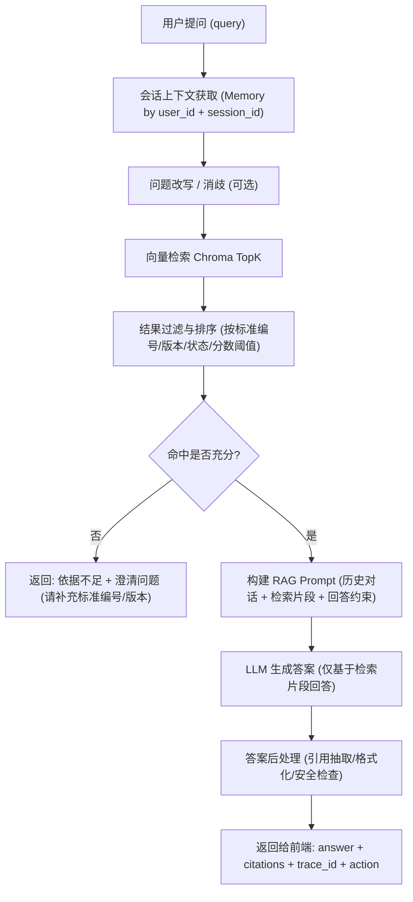

# 标准知识检索 RAG 接入方案与资料清单

## 1. 目标与范围
### 1.1 目标
- 将当前“通用模型回答”升级为“基于标准知识库的可引用回答”。
- 回答中必须包含标准出处（标准编号、版本、章节/条款）。
- 支持后续扩展到版本比对、风险提示、审计追溯。

### 1.2 本阶段范围（Step 10）
- 标准文档数据入库（元信息 + 条款切片）。
- 向量检索链路接入（召回 + 重排 + 生成）。
- `chat` / `chat/stream` 返回真实 `citations`。
- 建立最小可用评测集与离线验证流程。

### 1.3 本阶段不做
- 标准全文授权下载系统。
- 多租户复杂权限体系。
- 大规模异步批处理平台。

## 2. 技术方案（落地版）

### 2.1 数据模型
- 表 1：`standards`（标准元信息）
  - `standard_code`、`standard_name`、`version`、`status`
  - `publish_date`、`effective_date`、`source`
  - `industry`、`organization`（可选）
- 表 2：`standard_clauses`（条款切片）
  - `standard_id`、`chapter_path`、`clause_no`
  - `content`
  - `embedding`（pgvector）
  - `metadata`（JSON，可存页码/原始文档ID）

### 2.2 数据处理流程
1. 文档采集：接收标准正文和元数据。
2. 文本抽取：将 PDF/Word/HTML 转为可解析文本。
3. 清洗规范：去页眉页脚、目录噪声、重复片段。
4. 条款切片：按“章-节-条”优先切分，保留层级路径。
5. 向量化入库：生成 embedding 写入 Chroma。

### 2.3 在线问答链路
1. 意图识别（事实查询 / 条款问答 / 版本比对占位）。
2. Query 重写（补全标准编号、消歧版本）。
3. 检索召回（TopK，按标准/版本优先过滤）。
4. 重排（可先用简单相似度，后续接 reranker）。
5. 生成回答（带来源约束）。
6. 输出结构：
   - `answer`
   - `citations[]`（标准编号、版本、条款）
   - `data.intent`、`trace_id`

### 2.4 问答场景 RAG 流程图


### 2.5 引用与防幻觉规则
- 无检索命中时：明确“未找到充分依据”，不强答。
- 命中不足阈值时：触发澄清问题。
- 回答必须引用至少一个条款来源（MVP 可先允许少量例外并标记）。

### 2.6 Memory 与 RAG 的关系
- Memory 用于保留用户上下文与澄清信息。
- RAG 用于提供事实依据与可追溯引用。
- 生成阶段同时输入：`history + retrieved_context + user_query`。

### 2.7 元信息 RAG（当前先做）
说明：
- 当前阶段先不做全文条款检索，先做“标准元信息检索问答”。
- 数据来源固定为：`drms_standard_middle_sync`。
- 向量库固定为：`Chroma`。

字段映射（当前最小可用）：
- `a100`：标准号
- `a298`：标准名称
- `a101`：发布日期
- `a205`：实施日期
- `a206`：作废日期
- `a000` / `a200`：标准状态
- `a825cn`：中国标准分类（中文）
- `a826cn`：国际标准分类（中文）

向量文本拼装模板（每条标准一条 document）：
```text
标准号: {a100}
标准名称: {a298}
发布日期: {a101}
实施日期: {a205}
作废日期: {a206}
标准状态: {a000}
细分状态: {a200}
中国标准分类（中文）: {a825cn}
国际标准分类（中文）: {a826cn}
```

Chroma 存储约定：
- `collection`: `standards_meta_v1`
- `id`: `drms_standard_middle_sync:{id}`
- `document`: 上述模板拼装结果
- `metadata`: `id/a100/a298/a101/a205/a206/a000/a200/a825cn/a826cn/source_table`

### 2.8 已落地脚本（可直接执行）
- 脚本路径：`backend/scripts/ingest_standards_meta_to_chroma.py`
- Embedding 模型：`text-embedding-v4`
- Embedding 接口：OpenAI 兼容模式（默认 `https://dashscope.aliyuncs.com/compatible-mode/v1`）
- 源库：PostgreSQL（`drms_standard_middle_sync`）
- 向量库：本地 Chroma（`standards_meta_v1`）

执行命令：
```bash
cd backend
python scripts/ingest_standards_meta_to_chroma.py --truncate
```

测试命令（先导入 10000 条）：
```bash
cd backend
python scripts/ingest_standards_meta_to_chroma.py --truncate --count 10000
```

## 3. 你需要提供的资料清单（重点）

## 3.1 P0（必须先提供）
1. PostgreSQL 连接信息（host/port/db/user/password 或 DSN）。
2. 表名确认：`drms_standard_middle_sync`。
3. 字段确认：`a101`、`a825cn`、`a826cn`（以及 `a100`、`a298`）。
4. 一组业务高频问题（至少 50 条）：
   - 真实提问方式
   - 期望回答方向

## 3.2 P1（强烈建议）
1. 字段清洗规则（空值、脏值、日期格式规范）。
2. 术语同义词表（例如行业缩写、别名）。
3. 黑名单问题类型（不希望系统回答的内容范围）。

## 3.3 P2（后续优化）
1. 标准全文或条款JSON（用于下一阶段条款级RAG）。
2. 标准更新节奏（周更/月更）与责任人。
3. 质量评分规则（正确/部分正确/错误定义）。

## 4. 实施步骤（Step 10 细化）

状态更新（2026-02-28）：
- 子步骤 10.1 已完成。
- 子步骤 10.2 已完成。
- 子步骤 10.3 已完成（数据向量化阶段完成）。
- 当前进入子步骤 10.4（问答链路接入与 citations 输出）。

### 子步骤 10.1：从 PostgreSQL 读取元信息
- 输入：`drms_standard_middle_sync` 表。
- 输出：待向量化记录集（不依赖 `is_deleted` 字段）。
- 验收：可稳定读出 `a100/a298/a101/a825cn/a826cn` 字段。
- 当前状态：已完成。

### 子步骤 10.2：构造元信息 document
- 输入：步骤 10.1 记录集。
- 输出：每条标准一条 document（模板见 2.7）。
- 验收：随机抽检 50 条，发布日期与分类字段拼装正确率 >= 95%。
- 当前状态：已完成。

### 子步骤 10.3：向量化并写入 Chroma
- 输入：步骤 10.2 结果。
- 输出：`standards_meta_v1` collection。
- 验收：全量 upsert 完成，记录数与源表对齐（允许少量脏数据过滤）。
- 当前状态：已完成。
- 已有脚本：
  - `backend/scripts/ingest_standards_meta_to_chroma.py`（导入向量）
  - `backend/scripts/test_chroma_vectors.py`（检索验证）

### 子步骤 10.4：问答生成与引用输出
- 输入：Chroma 检索结果 + 用户问题 + 会话历史。
- 输出：回答 + `citations`（标准号/标准名称/发布日期/分类）。
- 验收：有引用回答占比 >= 90%（MVP门槛）。
- 当前状态：进行中。

### 子步骤 10.5：回归测试与参数调优
- 输入：固定问题集。
- 输出：评测报告（准确率/引用率/响应时延）。
- 验收：达到阶段目标后进入 Step 11。

## 5. 验收指标（Step 10）
- 准确率（离线问题集）>= 80%
- 引用覆盖率 >= 90%
- 响应时间 P95 <= 5s（不含外部不可控波动）
- 明显幻觉率可控（无依据强答比例持续下降）

## 6. 风险与应对
- 风险：文档质量不稳定（扫描件/格式混乱）
  - 应对：先只纳入可解析文本，扫描件单独处理
- 风险：版本号混乱导致引用错误
  - 应对：先强制版本字段，不完整数据不入库
- 风险：检索命中低
  - 应对：补同义词、调切片策略、提高过滤质量

## 7. 交付物
- 数据导入脚本（含清洗、切片、入库）
- 检索与引用服务模块
- 更新后的 `chat`/`chat/stream` 输出（真实 citations）
- Step 10 评测报告（可复跑）
